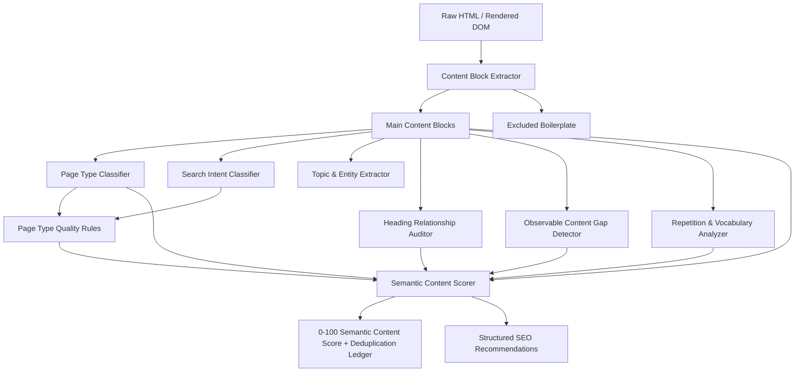

# CONTENT & SEMANTIC SEO INTELLIGENCE GUIDE

## Executive Summary
The **Content & Semantic SEO Intelligence Engine (Phase 6)** delivers deep, deterministic evaluation of webpage quality, structural integrity, topical coverage, heading relationships, search intent alignment, and information value.

### Guiding Principles & Philosophy
1. **Never Assume "More Keywords = Better SEO"**: The analyzer never recommends keyword stuffing, arbitrary density targets, or repetitive filler.
2. **Never Treat Word Count as Standalone Quality Measure**: Content depth is evaluated *contextually* against page type expectations. A 30-word contact page or 120-word product specification is adequate and never penalized as "thin content".
3. **Be Conservative with Semantic Conclusions**: Required topics are never inferred merely because they are common on other pages. Conclusions prefer `UNKNOWN` or `LOW` confidence over unsupported assumptions.
4. **Root-Cause Deduplication in Scoring**: Deductions group symptoms under a single root cause (e.g., thin text deducts once under `CONTENT_INSUFFICIENT_DEPTH` rather than independently docking points for word count, topical coverage, heading depth, and structure).
5. **No Metric Fabrication**: The engine never fabricates SERP ranking positions, search volumes, or CPC metrics without an authenticated external provider.

---

## Architecture Overview

---

## Core Modules & Methodology

### 1. Block-Level Content Extractor (`lib/content/contentExtractor.ts`)
- Partitions DOM text into discrete `ContentBlock`s (paragraphs, headings, lists, tables, quotes, Q&A blocks, and product specs).
- Strips structural boilerplate: `<header>`, `<footer>`, `<nav>`, `<aside>`, `.cookie-banner`, `.advertisement`, and modals.
- Computes `mainContentWordCount`, `excludedWordCount`, `contentToHtmlRatio`, and `boilerPlateRatio`.

### 2. Conservative Page Type Classifier (`lib/content/pageTypeClassifier.ts`)
Classifies page type into:
- `ARTICLE`: Editorial blog posts, guides, tutorials.
- `PRODUCT`: E-commerce product specifications, prices, add-to-cart actions.
- `SERVICE`: Service offerings, scope, value propositions.
- `LOCAL_BUSINESS`: Physical address, operating hours, phone, local service area.
- `DOCUMENTATION`: Code syntax, technical parameters, developer references.
- `FAQ`: Distinct question-and-answer pairs, `
` accordion markup.
- `CONTACT`: Direct contact channels (email, phone, address, contact form).
- `CATEGORY_PAGE`: Catalog grids, product/post collections.
- `HOMEPAGE` / `LANDING_PAGE` / `UNKNOWN`.

### 3. Search Intent Classifier (`lib/content/intentClassifier.ts`)
Infers user search intent with cautious confidence levels (`HIGH`, `MEDIUM`, `LOW`, `UNKNOWN`):
- `INFORMATIONAL`: Explanations, how-to guides, educational context.
- `COMMERCIAL_INVESTIGATION`: Reviews, comparison tables, "vs", top lists.
- `TRANSACTIONAL`: Direct purchasing, discounts, order checkout.
- `LOCAL`: Local area, opening hours, directions.
- `NAVIGATIONAL`: Brand gateway, portal login.
- `MIXED`: Hybrid content combining informational guidance with commercial pathways.

### 4. Contextual Topical Depth Evaluator (`lib/content/topicalCoverage.ts`)
Maps topic coverage levels:
- `DEEPLY_COVERED`: Primary topic supported across title, H1, H2, and multiple body paragraphs.
- `MEANINGFULLY_COVERED`: Topic present in headings and main text.
- `BRIEFLY_COVERED`: Topic mentioned in 1-2 sections.
- `MENTIONED`: Occurs once in body text.
- `NOT_DETECTED`: Absent from content.

#### Tailored Benchmarks:
| Page Type | Minimal Words | Substantial Words | Deep Words |
| :--- | :--- | :--- | :--- |
| **ARTICLE** | 300+ | 600+ | 1,200+ |
| **DOCUMENTATION** | 200+ | 500+ | 1,000+ |
| **SERVICE** | 120+ | 300+ | 700+ |
| **PRODUCT** | 80+ | 200+ | 500+ |
| **FAQ** | 80+ | 250+ | 600+ |
| **LOCAL BUSINESS**| 60+ | 150+ | 400+ |
| **CONTACT** | 25+ | 60+ | 150+ |

### 5. Heading-to-Content Relationship Auditor (`lib/content/headingRelationship.ts`)
- Validates that every heading has direct supporting text (>= 10 words or sub-headings).
- Detects empty headings that create navigation dead ends (`CONTENT_HEADING_WITHOUT_SUPPORT`).
- Detects heading topic drift when the section text completely diverges from the heading title.

### 6. Observable Content Gap Detector (`lib/content/contentGapDetector.ts`)
- Identifies empty heading promises (heading declares a topic but contains no content).
- Identifies missing introductions on articles and documentation guides.
- Identifies missing user-supplied target keywords (`targetKeywords`).
- Never fabricates arbitrary missing topics.

### 7. Repetition & Vocabulary Diversity Analyzer (`lib/content/repetitionAnalyzer.ts`)
- Detects exact sentence duplication and repetitive n-grams (4-6 word repeated blocks).
- Computes length-adjusted vocabulary diversity score (Type-Token Ratio).
- Prevents false-positive penalties on legitimate brand names and technical model specifications.

### 8. Semantic Content Score & Deduction Ledger (`lib/content/semanticScorer.ts`)
Calculates four sub-dimension scores and an overall score:
- **Topical Depth (0-100)**: Evaluates sufficiency of content for the declared page type.
- **Structural Clarity (0-100)**: Evaluates heading support and paragraph hierarchy.
- **Intent Satisfaction (0-100)**: Evaluates alignment with search query expectations.
- **Originality & Substance (0-100)**: Evaluates vocabulary diversity and absence of duplication.
- **Root-Cause Deduplication**: Guarantees that thin content is deducted once under `CONTENT_INSUFFICIENT_DEPTH` rather than stacking separate penalties for word count, topical depth, and layout.

---

## Recommendation Structure
Every issue generated by the engine conforms to the structured format:
- **Observation / Title**: Specific problem identified.
- **Severity**: `CRITICAL` | `WARNING` | `RECOMMENDATION` | `GOOD` | `INFO`.
- **Evidence**: Concrete measurements extracted from the DOM.
- **Why It Matters**: Explanation of search engine and user impact.
- **Action**: Step-by-step guidance on what to change.
- **Before / After**: Concrete code/copy transformation example.
- **Expected Benefit**: Measurable organic search improvement.
- **Caution**: Guardrail against over-optimization or keyword stuffing.
- **`isMeasuredProblem: true`**.
